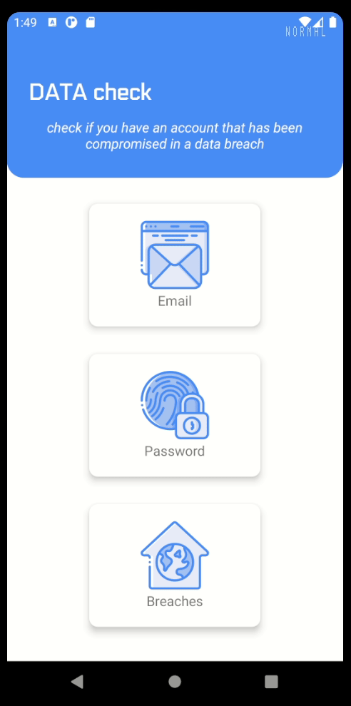

# DATA check [MAS-RAD-MWS](https://www.he-arc.ch/ingenierie/mas-rad-cas-dar)

## Projet Mobile Web Services

L'application permet via le service RESTful [haveibeenpwned.com](https://haveibeenpwned.com/API/v3)
de contrôler si une adresse email ou un mot de passe à été exposé
lors d'une fuite de données.

#### Vérification d'adresse email: 
[API Key](https://haveibeenpwned.com/API/Key) à renseigner dans l'interface HIBPService.kt
- @Headers("hibp-api-key: your-api-key")

#### Vérification de mot de passe:
Afin de garantir l’intégrité du mot de passe à vérifier, l’API applique le principe de 
Hash [k-Anonymity](https://en.wikipedia.org/wiki/K-anonymity).

## 📷 Demo

  

## ⚙ Tech

- Kotlin
- Retrofit 2
- GSON
- Picasso
- Material

## 🎯 Requirements

- minSdkVersion 16
- targetSdkVersion 30

##

[Report Bug](https://github.com/IIVR/mas-rad-mws/issues)

